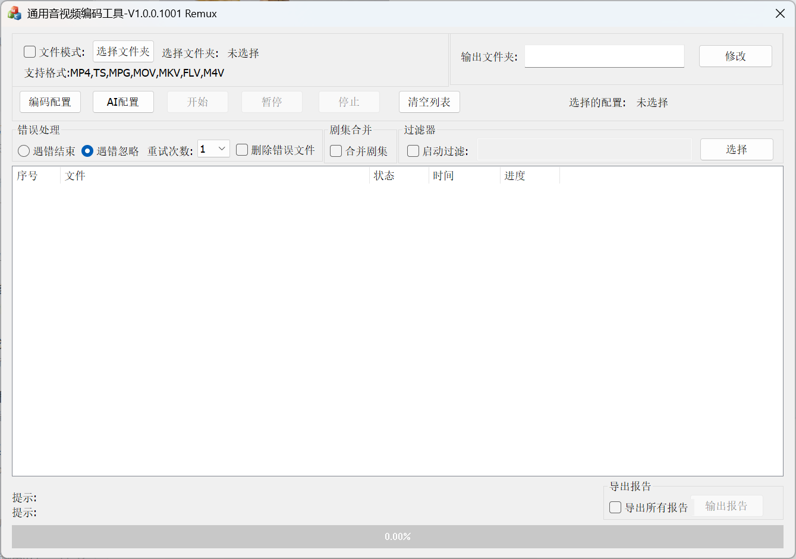
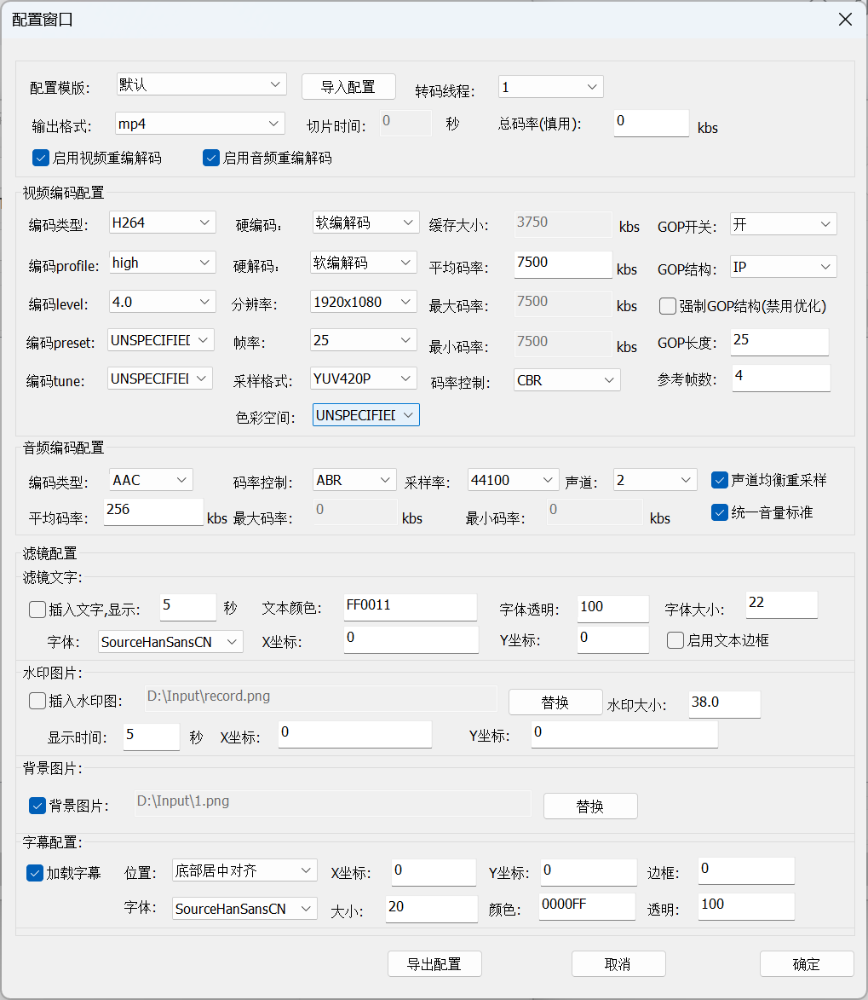
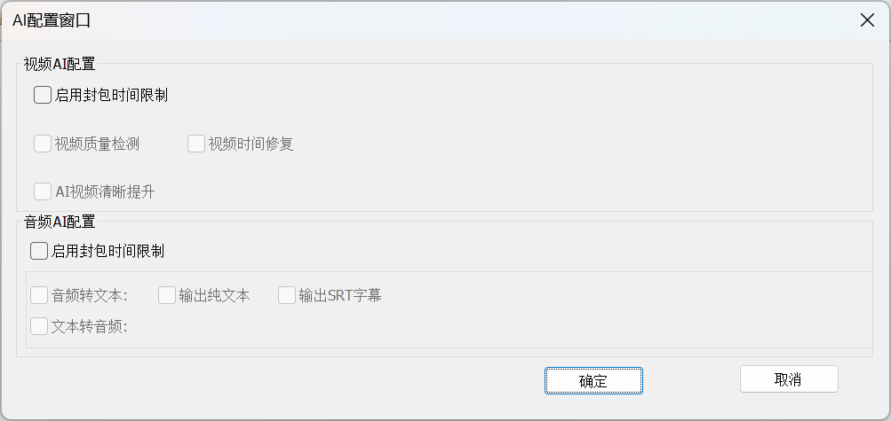

[Chinese](README.md) || [English](README.en.md)
# XEngine_AVCodecApp
AVCodecApp is a background service-based streaming media push/pull service for audio and video. It is not a streaming media server; it is a push/pull relay service that supports codecs, which can assist you in processing streaming media audio and video data.

## Introduction
Why develop this tool? Streaming media servers are already very mature and plentiful on the market. Therefore, we are not focusing on the streaming media service itself, but rather on derivative products, such as this software.
This software is primarily designed to assist existing streaming media servers because they typically only handle data forwarding and demuxing. They generally do not support audio/video codecs or image processing, such as overlaying images or text.
So, we provide this software to assist users who have requirements for processing audio and video.
Simply put, with this program, you can pull a live stream from your camera or other live source, process it through our program (including re-encoding, e.g., modifying resolution, bitrate, frame rate), and then push it directly to a streaming media server. If you don't want to pull data from a camera, you can seamlessly switch to a video file without interrupting the playback for the viewer. You can use the HTTP API interface to add a replay text overlay to the output video during the switch.
It consists of two programs: XEngine_AVCodecApp and XEngine_AVToolApp.

#### XEngine_AVCodecApp
XEngine_AVCodecApp is the core program. It provides audio/video codecs, stream pulling/pushing, audio/video filters, and OpenCV-based video image processing. It also offers an HTTP interface service to operate this server.
This program can run standalone, in which case you need to control it via the Http interface (refer to the communication protocol document). It can also run as a subprocess.
This program can handle your various requests. It is the core of everything. You can run it directly and test it via the interface.

###### How to Use
You should refer to the protocol document. First, use `create` to create a handle, then set the codec interface (skip if codec is not needed), then create the image filter processing interface (skip if not needed; this interface is only effective if codec is enabled), and then you can call `play` to schedule programs.
You can also implement your own program to schedule playback programs periodically. This is our recommended approach.
Finally, call `stop` when it is no longer needed.

#### XEngine_AVToolApp
This software is a collection of tools, primarily communicating with XEngine_AVCodecApp to perform file transcoding. This tool can uniformly transcode or remux media files from multiple folders.
It supports merging media files from multiple folders into a single file and supports all the functions of the core service. Explore its usage for specifics.
This tool only supports Windows.

## Why Choose Us
*   Rapid Iteration: Timely feature updates.
*   Technical Support: Comprehensive documentation and support, quick response to your questions.
*   Language Agnostic: Regardless of the language your client uses, you can choose the appropriate communication method.
*   Stable & Reliable: Implemented in C/C++, core framework validated over 10+ years. Balances stability and high performance.
*   Flexible Licensing: Supports various license types, including time-limited and usage-based models.

#### Choose the Right One
Most products on the market are either paid, have slow updates, lack features, or offer no technical support. By using our product, you don't need to worry about these aspects.

## Features
Our feature list includes but is not limited to the items below. Many planned features are under development.

Software Features:
1.  Supports HTTP protocol communication, HTTP API control (extensive API interfaces for flexible control over push/pull streams and codecs).
2.  Supports HTTP authentication.
3.  Supports push streaming (writing to files, pushing to streaming media servers) and pull streaming (reading files, live streams).
4.  Supports recording (MP4, TS, M3U8...).
5.  Supports multiple protocols for push/pull streams (RTMP, RTSP, RTP, UDP, FLV, files, etc.).
6.  Supports audio/video re-encoding, configurable codec parameters.
7.  Supports audio/video filter processing (frame rate modification, audio normalization, etc.).
8.  Supports video image processing (overlaying text, images, logo removal, etc.).
9.  Supports video rotation (e.g., 1080x1920 -> 1920x1080).
10. Supports seamless stream switching (seamless switching between live and file streams, uninterrupted playback).
11. Supports hardware acceleration (NVIDIA, INTEL, AMD).
12. Supports CBR (Constant Bitrate) for audio and video.
13. Supports remuxing only (without re-encoding).
14. Supports transcoding tool (XEngine_AVToolApp).
15. Supports file and stream merging.
16. Linux supports constant UDP bitrate output (TS verification tools won't report errors during stream switches).
17. Supports subtitles.
18. Supports batch file transcoding (XEngine_AVToolApp).
19. Supports playback scheduling and timed playback.
20. AI Support.
21. Mute and Black Screen Support.

## Installation

#### Windows
Run directly.

#### Linux
Requires Ubuntu 24.04 LTS. First, run the environment setup script AVCodec_ENVInstall.sh.
Then you can run `./XEngine_AVCodecApp` for testing.

#### macOS
Not currently supported.

## Registration
Our software requires registration for use, costing 200 RMB per year.unlimited 1000. Please contact us to register.
You can also try the trial version. The trial version does not support codecs, filters, or image processing.ai need unilimit version.

#### get more?
We can also provide the source code of the transcoding tool (2000).  
can also provide core source code; the specific price can be discussed by contacting us

## Screenshots

## Development History

## Follow Us
If you find this software helpful, please give us a STAR!
You can also follow us via WeChat.

## Issues
If you encounter any problems, please submit them via the Issues section.