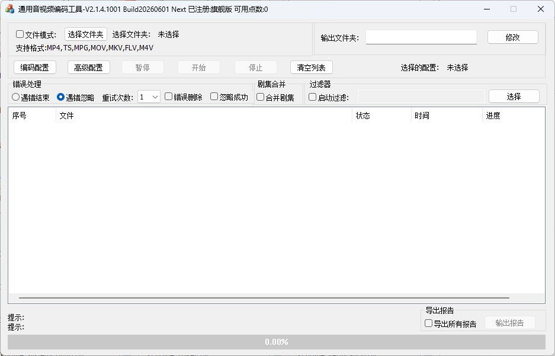
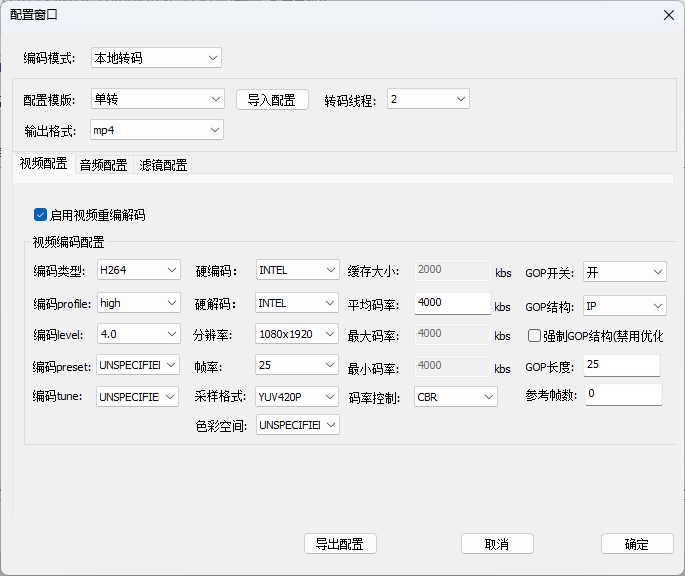
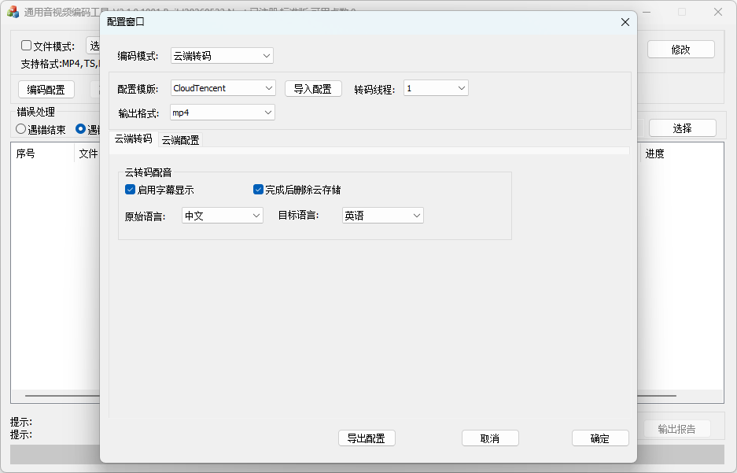
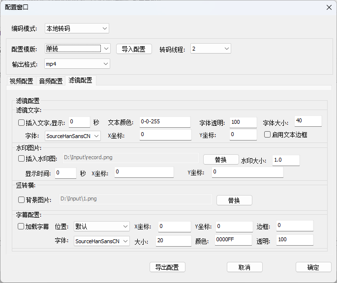
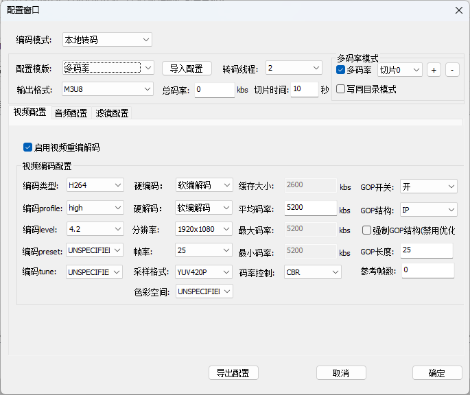
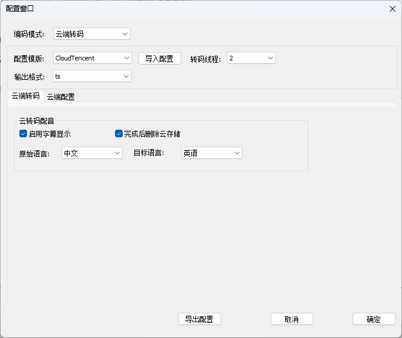
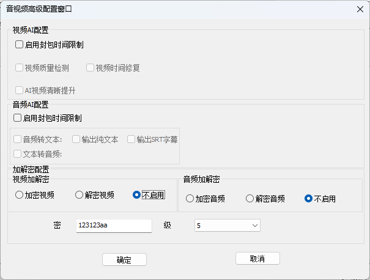
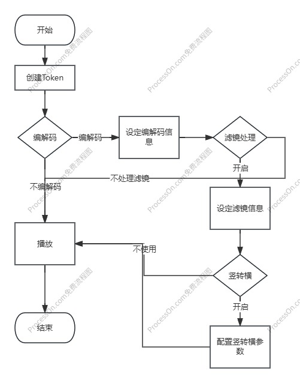
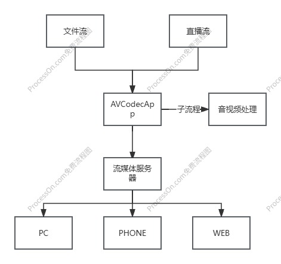

[中文](README.md) ||  [English](README.en.md)  
# XEngine_AVCodecApp
通用音视频编解码工具,通用音视频转码工具,音视频转码服务,音视频编解码服务  
XEngine_AVCodecApp是一个基于后台服务的流媒体音视频的推拉流服务,他不是流媒体服务器,他是一个支持编解码的推拉流中转服务,可以辅助你处理流媒体音视频数据.  
XEngine_AVCodecApp核心功能就是音视频转码,推拉流,录像,FAST直播/轮播,转码图像处理和AI音视频

## 介绍
为什么开发此工具?流媒体服务器目前市面上已经很成熟也很多了.所以我们不在关注流媒体服务这一块,而是关注衍生的一些产品,比如此软件.  
这个软件主要是为了辅助现在流媒体服务器,因为他们仅做数据转发和解封装,他们基本不支持音视频编解码,也不支持图像处理,比如叠加图片,文本等  
所以我们提供了此软件来协助对音视频有处理需求的用户.  
简单一点说,就是此程序你可以把你的摄像头或者其他直播流或者媒体文件通过此程序拉下来,然后通过我们程序处理重新编解码,比如修改分辨率,码流,帧率,然后再推流给流媒体服务器,他可以无感切换文件,播放端不断流.他还可以支持插件,我们可以提供原始YUV数据输入给插件,你们处理完后再返回给转码服务进行编码推流  
他有两个程序,XEngine_AVCodecApp 和 XEngine_AVToolApp.  

#### 为什么要使用此软件
传统的后端开源流媒体服务器（如 XEngine_StreamMedia、SRS 等）通常专注于网络层的协议解析与流转发，其核心职责是高效地处理推流与拉流，而非深度的音视频数据加工。  
而本软件定位为一款独立的音视频流预处理工具。它的核心作用是在流媒体推送到服务端之前，对其进行灵活的二次加工。例如：重新编解码、自定义码率与分辨率，以及应用图像滤镜（如叠加图片、文本水印等）。经本软件预处理后，再将标准的媒体流推送至后端的流媒体服务器。  
这种设计实现了“流处理”与“流分发”的解耦。相比于直接在底层流媒体服务器上修改代码进行二次开发，这种架构更加优雅、灵活，也大幅降低了开发与维护成本。

#### XEngine_AVCodecApp
XEngine_AVCodecApp是核心程序,他提供了对音视频的编解码,拉流推流,音视频滤镜以及opencv视频图像处理.并且提供了基于HTTP接口的服务,用来操作此服务器.  
此程序可以单独运行,那么你需要通过Http接口来处理,你可以参考通信协议文档.他也可以当做子程序运行.  
此程序可以处理你的各种请求.他是一切的核心,你可以直接运行他,然后通过接口测试验证.

###### 如何使用
你应该参考协议文档,首先create创建句柄,然后设置codec编解码接口(不需要编解码可以跳过),然后创建图像filter处理接口(不需要可以跳过,启用了编解码此接口才有效),然后可以调用play进行节目排班.  
你也可以自己实现一个程序来定时发送播放节目.这是我们推荐的方式  
最后在不使用的时候stop他

###### 配合使用
这个软件需要一个流媒体服务,如果你想做直播推流,你可以使用我们的XEngine_StreamMedia服务,也可以使用第三方srs等流媒体服务器,在调用我们的创建流接口的时候指定这个服务地址即可推流

#### XEngine_AVToolApp
此软件是一个工具集合,他主要是与XEngine_AVCodecApp进行通信实现文件转码,此工具可以对多个文件夹下的媒体文件进行统一转码输出,或者重新解复用输出.  
他支持合并多个文件夹下的媒体文件为单一文件,支持所有核心服务的功能.具体可以自己探索使用  
此工具只支持windows.

## 为什么选择我们
快速迭代:功能更新及时  
技术支持:完善的技术文档和技术支持,快速响应你的问题  
不限语言:不关心你的客户端使用的语言,你可以选择自己合适的通信方式  
稳定可靠:基于C/C++实现的,核心框架10年+验证.稳定与高性能兼容  
灵活验证:支持各种类型授权,支持时间和次数等等模式 

#### 选择对的
目前市面上的大多数产品不是收费就是产品更新慢，或者功能不全。没有技术支持。使用我们的产品你完全不需要有这方便的担心。  

## 软件特性  
我们的功能列表不仅包括下面的，还有很多待开发的功能正在计划中。  
软件特性:  
1. 支持HTTP协议通信,支持HTTP API控制(大量API接口帮助你随心所欲的控制推拉流编解码)
2. 支持HTTP验证
3. 支持推流(写文件和推流给流媒体服务)和拉流(读文件和直播流)
4. 支持录像(MP4,TS,M3U8...)
5. 支持多种协议推拉流(RTMP.RTSP,RTP,UDP,FLV,文件等等)
6. 支持对音视频重新编解码,支持配置编解码参数
7. 支持音视频滤镜处理(帧率修改,音频声音大小规范等)
8. 支持视频图像处理(叠加文本,图像,图标消除等)
9. 支持视频竖转横(1080x1920->1920x1080)
10. 支持无感流切换(直播流和文件流随意切换,播放端无感播放)
11. 支持视频硬编解码(NVIDIA,INTEL,AMD)
12. 支持音频和视频CBR码流封装
13. 支持仅重采样(不重新编解码)
14. 支持转码工具使用(XEngine_AVToolApp)
15. 支持文件与流合并
16. linux支持输出恒定UDP码流(切换流TS验证工具不报错)
17. 支持字幕
18. 支持多文件转码处理(XEngine_AVToolApp)
19. 支持播放排班以及定时播放
20. AI支持
21. 静音和黑屏支持
22. 支持云端配音和转码
23. 支持HTTP和音视频插件
24. 基于TS的SCTE-35流协议格式输出支持

## 安装教程

#### Windows
直接运行即可

#### Linux
需要Ubuntu24.04 lts 或者rockylinux 10系统,首先执行环境安装AVCodec_ENVInstall.sh 脚本.  
然后可以运行 ./XEngine_AVCodecApp 服务进行测试

#### Macos
直接运行安装脚本即可,其他同linux

## 如何注册
我们的软件需要注册使用,请联系我们注册  
- 试用版:免费,仅提供格式重封装  
- 标准版:一年200元,提供编解码服务  
- 专业版:一年300元,提供滤镜特效支持  
- 旗舰版:一年500元,提供AI检测和处理支持  
- 无限制:无限制版本1000.无时间限制  
你也可以试用,试用用户不支持编解码和滤镜图像处理,AI功能需要无限制版本

#### 更多需求?
我们也可以提供转码工具的源码(2000).  
也可以提供核心源码,具体价格可以联系我们商议  

## 程序截图

#### 数据流程图

## 目录结构
- AVCodec_APPExample   服务端通信转码示例
- XEngine_Package      环境安装包

## 关注我们
如果你觉得这个软件对你有帮助,请你给我们一个START吧  
也可以通过微信关注我们  

## 提交问题

如果你有问题,可以在issues中提交
